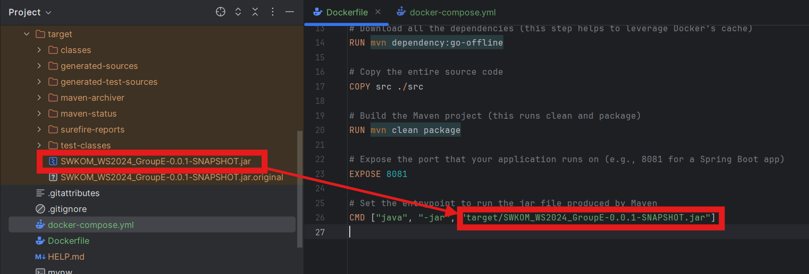

# Projekt: Paperless

## Swagger

Swagger ist auf **http://localhost:8081/swagger-ui.html** verfügbar. Dort kannst du die REST-Endpunkte der Anwendung interaktiv ausprobieren.

## Wichtiger Hinweis zum JAR-File

Falls sich das JAR-File nicht im `target`-Ordner befindet, folge diesen Schritten:

1. **Projekt bauen:**
    - In deiner IDE: `Build > Rebuild Project` ausführen.

2. **Maven-Befehl ausführen:**
    - Im Projektverzeichnis folgenden Befehl ausführen, um das JAR-File zu erstellen:

   ```bash
   ./mvnw clean package
   ```

3. **Dockerfile anpassen:**
    - Stelle sicher, dass in der `Dockerfile` der Pfad zur erzeugten JAR-Datei korrekt eingetragen ist:

   ```Dockerfile
   CMD ["java", "-jar", "target/PaperlessREST-0.0.1-SNAPSHOT.jar"]
   ```

Hier ist ein Screenshot des JAR-Files im `target`-Ordner:


