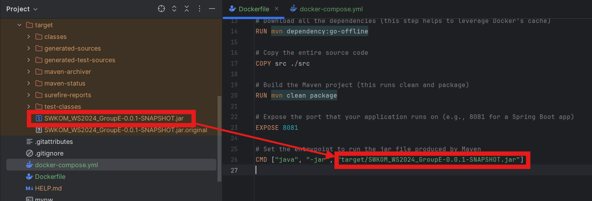

# Projekt: SWKOM_WS2024_GroupE

## Übersicht

Dieses Projekt enthält einen REST-Server, der mit Docker und Docker Compose in einem Container ausgeführt wird. Der Server wird auf dem lokalen Port 8081 bereitgestellt, und Swagger ist ebenfalls verfügbar.

## Voraussetzungen

- Docker installiert
- Docker Compose installiert
- Das Projekt enthält eine funktionierende `Dockerfile` und `docker-compose.yml`.

## Docker Compose Befehle

### 1. Docker-Image bauen
Um das Docker-Image zu bauen, verwende den folgenden Befehl:

```bash
docker-compose build
```

### 2. Container starten
Um den Container zu starten und die Anwendung auszuführen:

```bash
docker-compose up
```

Die Anwendung ist nun auf **http://localhost:8081** verfügbar.

### 3. Container stoppen
Um den Container zu stoppen, nutze:

```bash
docker-compose down
```

## Swagger

Swagger ist auf **http://localhost:8081/swagger-ui.html** verfügbar. Dort kannst du die REST-Endpunkte der Anwendung interaktiv ausprobieren.

## Wichtiger Hinweis zum JAR-File

Falls sich das JAR-File nicht im `target`-Ordner befindet, folge diesen Schritten:

1. **Projekt bauen:**
    - In deiner IDE: `Build > Rebuild Project` ausführen.

2. **Maven-Befehl ausführen:**
    - Im Projektverzeichnis folgenden Befehl ausführen, um das JAR-File zu erstellen:

   ```bash
   ./mvnw clean package
   ```

3. **Dockerfile anpassen:**
    - Stelle sicher, dass in der `Dockerfile` der Pfad zur erzeugten JAR-Datei korrekt eingetragen ist:

   ```Dockerfile
   CMD ["java", "-jar", "target/SWKOM_WS2024_GroupE-0.0.1-SNAPSHOT.jar"]
   ```

Hier ist ein Screenshot des JAR-Files im `target`-Ordner:


